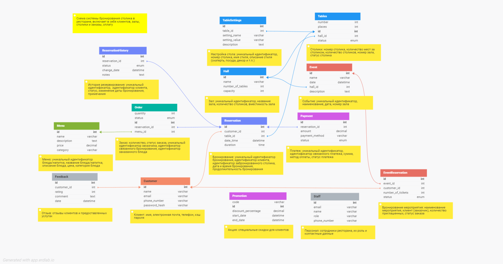
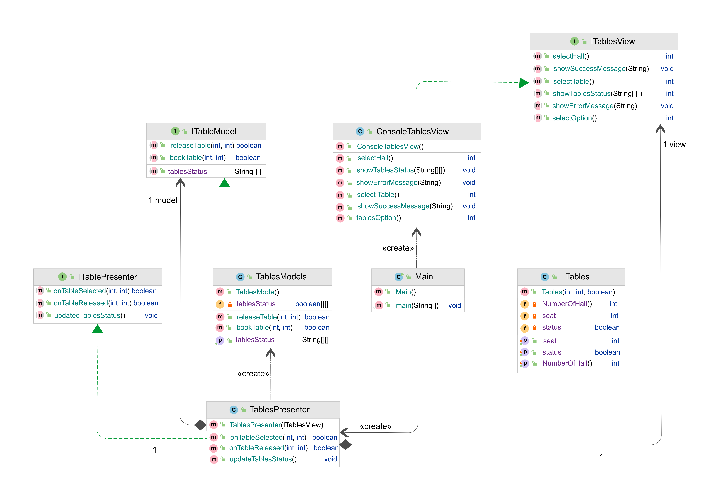

## Архитектура ПО

### Урок 8. Типы архитектур прикладных приложений (мобильные): MVC, MVP, MVVM.

**Задание 1**.Разработать экранные формы интерфейса в https://www.figma.com/ или https://app.diagrams.net/.

**Задание 2**.Разработать полную ERD домена в https://www.dbdesigner.net/.

**Задание 3**.Разработать блок-схему алгоритма взамодействия MVP.

### РЕШЕНИЕ:

1) UI - экранная форма пользовательского интерфейса

2) ERD-диаграмма домена 

3) UML - блок-схема алгоритма взамодействия MVP

